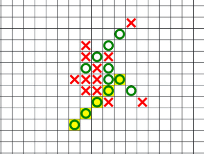

# Gomoku Web App
Five in a Row game against AI bot ([MTD](https://en.wikipedia.org/wiki/MTD(f))
algorithm) using 25x25 grid.

# Usage
You will need to have docker compose installed (at least version `2.3.3`).  Run
`make start` to start the app and `make stop` to terminate the app. The app should
listen on port 80 for the UI (the game) and 8000 for the backend server.